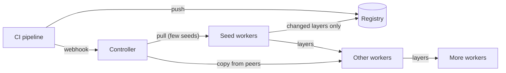

# 🦆🔪 Angry Duck

**Peer-to-peer image distribution, pull rescue and image cleanup for Kubernetes nodes running containerd.**

Angry Duck puts a freshly pushed image on every node before your pods ask for
it. The registry serves each image only a handful of times, and the rest of
the fleet gets it from peers. When a node can't pull an image that another
node already has, Angry Duck copies it over. It also keeps node disks tidy by
removing images nothing has used.

It is two small, dependency-free Go binaries: a controller and a per-node
worker. It works with the containerd and registry you already run.

## Why we built it

We run large Kubernetes fleets, and every deploy looked the same: CI pushed an
image, the rollout started, and dozens of nodes asked the registry for the same
layers at the same moment. The trouble came in three forms.

- **Rollouts waited on the registry.** Each node downloaded the full set of
  changed layers on its own, so a rollout was only as fast as the registry's
  slowest moment.
- **Pods got stuck on images that were right next door.** A broken route, a
  firewall rule, a registry hiccup or an image deleted upstream left pods in
  `ImagePullBackOff`, while the exact image sat on other nodes in the same
  cluster.
- **Disks filled with images nobody used.** kubelet's image GC only acts at
  disk pressure, late and without knowing which images matter for a rollback.

Peer-to-peer image tools help once a pull is under way. We wanted something
that also acts *before* the pull, by placing images ahead of the rollout,
rescues pulls that fail anyway, cleans up afterwards, and gets out of the way
when it has nothing to add.

## Philosophy

- **Never in the critical path.** Every feature is best-effort. If Angry Duck
  is down or wrong, containerd pulls from the registry exactly as it would
  without it. CI calls the webhook with `|| true`.
- **The registry stays the source of truth.** Tags always resolve at the
  registry, so a moved tag is never served stale. Angry Duck only moves
  content that is addressed by digest.
- **Verify what can be verified.** Layers travel as blobs and containerd checks
  every digest on import. Unpacked snapshots are shipped only as a last resort.
- **Use what is already on the node.** The worker runs the node's own `crictl`,
  `ctr` and `tar` through a chroot. Nothing is installed or replaced, and no
  runtime binaries ship in the image.
- **Be gentle.** Transfers are bounded per node and per cluster, retries back
  off, and cleanup works in small batches.
- **Explain every decision.** Each decision is logged on one line, exposed in
  `/status` and counted in Prometheus.

## How it works



A **controller** (one replica) receives a webhook from CI, knows which layers
every node holds, and plans all the work. A **worker** on every node reports
its disk, images and layers, and does the pulling, sending, receiving, mirroring
and cleanup.

| Feature | What it does | Details |
|---|---|---|
| **Preheat** | On push, the few nodes that already hold most of the image pull it, so the registry serves little more than the changed layers. | [Preheat](docs/preheat.md) |
| **Propagation** | Every other node gets the image from peers, one transfer per source at a time, doubling the holders every round. | [Propagation](docs/propagation.md) |
| **Rescue** | A pod stuck in `ImagePullBackOff` gets its image copied from a node that has it, for any image. | [Rescue](docs/rescue.md) |
| **Transfers** | Only missing layers move, as digest-verified blobs from any peer, with snapshots as a last resort. | [Transfers](docs/transfers.md) |
| **Mirror** | A pull-only mirror on every node answers containerd from the node or a peer, and falls back to the registry. | [Mirror](docs/mirror.md) |
| **Image cleanup** | Removes images unused for 6 hours, and oldest first when the disk is above 70%, keeping rollback images longest. | [Image cleanup](docs/image-cleanup.md) |

## Quick start

You need Kubernetes 1.30+, containerd with the overlayfs snapshotter, and
node-exporter on every node. See [Installation](docs/installation.md) for the
full steps.

```bash
# Build and push the two images, then create the namespace and secrets.
kubectl apply -f deploy/stg/namespace.yaml
kubectl -n angryduck create secret generic angryduck-rescue-token --from-literal=token=$(openssl rand -hex 32)

# Review deploy/stg/configmap-env.yaml, then:
kubectl apply -f deploy/stg/
```

Then call the webhook from CI after every push:

```bash
curl -fsS -X POST https://angryduck.example.com/angryduck/webhook/preheat \
  -H 'Content-Type: application/json' -d "{\"image\":\"${IMAGE}\"}" || true
```

## Documentation

| Guide | Contents |
|---|---|
| [Architecture](docs/architecture.md) | Components, reporting, state, and an image's life from push to cleanup. |
| [Installation](docs/installation.md) | Requirements, deployment, CI integration and verification. |
| [Configuration](docs/configuration.md) | Every setting, with defaults. |
| [Operations](docs/operations.md) | Status, logs, troubleshooting, upgrades and bootstrapping a node. |
| [Observability](docs/observability.md) | Metrics, the Grafana dashboard and suggested alerts. |
| [API](docs/api.md) | Controller and worker HTTP endpoints. |
| [Security](docs/security.md) | Privileges, trust boundaries and hardening. |
| [Development](docs/development.md) | Code layout, building and testing. |
| [Comparison](docs/comparison.md) | Similar tools, feature by feature, and why one tool. |

Feature guides: [Preheat](docs/preheat.md) ·
[Propagation](docs/propagation.md) · [Rescue](docs/rescue.md) ·
[Transfers](docs/transfers.md) · [Mirror](docs/mirror.md) ·
[Image cleanup](docs/image-cleanup.md)

## Status

The current version is **1.8.4**; see the [changelog](CHANGELOG.md). Angry
Duck targets Linux nodes running containerd. Preheat pulls can also use
`crictl` or `docker`, but propagation, rescue, the mirror and cleanup work
through containerd directly.
