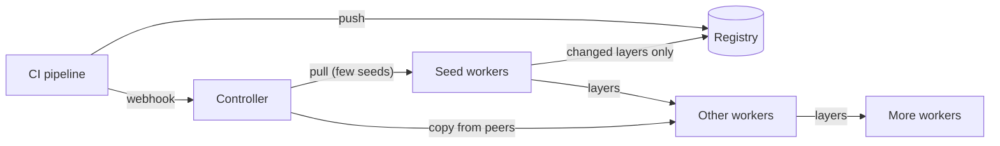

# 🦆🔪 Angry Duck

[](LICENSE)
[](https://github.com/hatam-abolghasemi/Angry-Duck/releases)

**An image lifecycle manager for Kubernetes.** It gets new images onto your
nodes before the rollout asks for them, gets pods started when the registry
can't help, and keeps disks healthy, from the push to the cleanup.

Angry Duck gets a freshly pushed image onto your nodes while the rest of your
pipeline is still running, so when the rollout starts, the image is already
there. The registry serves each new layer about once and nodes share the rest
among themselves. When a node can't pull an image a neighbor already has, the
neighbor hands it over. Recent images stay on the nodes, so rolling back starts
containers instead of downloading, and images nothing uses anymore are
cleaned up before they crowd the disk.

Two small Go binaries, a controller and a worker per node, working with the
containerd and registry you already run. No database, no extra storage, no
changes to your pods.

## How it started

It started with speed. Our clusters see hundreds of deploys a day, and every
rollout waited on the same thing: dozens of nodes downloading the same layers
from the registry at the same moment, only after pods had been scheduled. CI
had pushed the image minutes earlier. Why was nobody fetching it yet?

Then the other problems showed up, one by one:

- **The registry went down,** and rollouts and rollbacks stopped with it.
- **The registry was up, but the image wasn't there anymore,** while the exact
  image was sitting on the node next door. Pods stayed in `ImagePullBackOff`
  anyway.
- **Disks hit pressure because apps logged too much.** Container logs and
  images share the same disk. We can't make an app log less, but we could make
  sure images never made it worse, and free space early when it happened,
  without throwing away the image the next rollback needs.

We tried Dragonfly, then Spegel. Neither made us happy, and each covered only
part of the problem. So we built the tool we wanted, one that looks after an
image's whole life on the node. The full story is in
[How Angry Duck came to be](docs/story.md).

## The idea

**Start early, run in parallel, never block.** A push is the earliest moment
anyone knows an image will be needed, so CI tells Angry Duck right then with a
webhook and moves on. While CI updates manifests and your GitOps tool syncs,
the image is already spreading through the cluster. CI never waits for it, and
a deploy never depends on it: if Angry Duck is down or wrong, containerd pulls
from the registry exactly as it would without it.

Inside, the same rule holds. Nothing waits for a schedule when it can react to
an event: workers follow containerd's events, the controller watches stuck
pods, and every finished transfer immediately starts the next one. Each layer
spreads on its own, from any node that has it, without waiting for whole
images. The registry is only asked for what no node has yet.

**Cleanup is the other half of distribution.** Putting every new image on
every node is only safe if something keeps disks healthy. Angry Duck removes
images nothing has used for hours, frees space early when a disk runs high,
and keeps the last few images of each app for rollbacks. Distribution pauses
on a full node until cleanup has made room.

Read [Design](docs/design.md) for the reasoning behind each choice.

## How it works



A **controller** (one replica) receives a webhook from CI, knows which layers
every node holds, and plans all the work. A **worker** on every node reports
its disk, images and layers, and does the pulling, sending, receiving, mirroring
and cleanup.

| Feature | What it does | Details |
|---|---|---|
| **Preheat** | Image pre-pull on push: the few nodes that already hold most of the image pull it, so the registry serves little more than the changed layers. | [Preheat](docs/preheat.md) |
| **Propagation** | Every other node gets each layer from whichever node already has it, the moment any node has it. The registry serves each layer about once. | [Propagation](docs/propagation.md) |
| **Rescue** | A pod stuck in `ImagePullBackOff` gets its image copied from a node that has it, for any image. | [Rescue](docs/rescue.md) |
| **Transfers** | Only missing layers move, as digest-verified blobs from any peer, with snapshots as a last resort. | [Transfers](docs/transfers.md) |
| **Mirror** | A pull-only mirror on every node answers containerd from the node or a peer, and falls back to the registry. | [Mirror](docs/mirror.md) |
| **Image cleanup** | Removes images unused for 6 hours, and oldest first when the disk is above 70%, keeping rollback images longest. | [Image cleanup](docs/image-cleanup.md) |

## Quick start

You need Kubernetes 1.30+, containerd with the overlayfs snapshotter, and
node-exporter on every node. Check the
[node settings](docs/node-settings.md) that decide how much Angry Duck can do,
then install.

Prebuilt images for every release are on GitHub Container Registry:
`ghcr.io/hatam-abolghasemi/angry-duck-controller` and
`ghcr.io/hatam-abolghasemi/angry-duck-worker`. The Helm chart uses them by
default:

```bash
helm upgrade --install angryduck ./charts/angryduck \
  --namespace angryduck --create-namespace \
  --set registryCredentials.existingSecret=registry-pull \
  --set ingress.enabled=true --set ingress.host=angryduck.example.com
```

See [Helm](docs/helm.md) for the values, or [Installation](docs/installation.md)
for plain manifests. Then call the webhook from CI after every push:

```bash
curl -fsS -m 10 -X POST https://angryduck.example.com/webhook/preheat \
  -H "Authorization: Bearer ${ANGRYDUCK_WEBHOOK_TOKEN}" \
  -H 'Content-Type: application/json' -d "{\"image\":\"${IMAGE}\"}" || true
```

## Documentation

New here? Read [Design](docs/design.md), then [Installation](docs/installation.md)
or [Helm](docs/helm.md), then pick a setup from [Recipes](docs/recipes.md).

| Guide | Contents |
|---|---|
| [Story](docs/story.md) | How Angry Duck came to be, one problem at a time. |
| [Design](docs/design.md) | Why it works the way it does. |
| [Architecture](docs/architecture.md) | Components, reporting, state, and an image's life from push to cleanup. |
| [Installation](docs/installation.md) | Requirements, deployment, CI integration and verification. |
| [Helm](docs/helm.md) | Installing with the chart, its values, tokens and the webhook ingress. |
| [Node settings and limits](docs/node-settings.md) | containerd and kubelet settings that help, CI and workload usage, and what Angry Duck can't do. |
| [Recipes](docs/recipes.md) | Ready-made settings for common clusters and goals. |
| [Configuration](docs/configuration.md) | Every setting, with defaults. |
| [Operations](docs/operations.md) | Status, logs, troubleshooting, upgrades and bootstrapping a node. |
| [Observability](docs/observability.md) | Metrics, the Grafana dashboard and suggested alerts. |
| [API](docs/api.md) | Controller and worker HTTP endpoints. |
| [Security](docs/security.md) | Privileges, trust boundaries and hardening. |
| [Development](docs/development.md) | Code layout, building and testing. |
| [Comparison](docs/comparison.md) | Similar tools, feature by feature, and why one tool. |

Feature guides: [Preheat](docs/preheat.md) ·
[Propagation](docs/propagation.md) · [Rescue](docs/rescue.md) ·
[Transfers](docs/transfers.md) · [Mirror](docs/mirror.md) ·
[Image cleanup](docs/image-cleanup.md)

## Status

The current version is **1.8.10**; see the [changelog](CHANGELOG.md). Angry
Duck targets Linux nodes running containerd 1.6 or later.

## Feedback and contributing

Running Angry Duck, or thinking about it? Tell us how it goes in
[Discussions](https://github.com/hatam-abolghasemi/Angry-Duck/discussions).
Bugs and feature requests go in
[Issues](https://github.com/hatam-abolghasemi/Angry-Duck/issues), and security
reports through the [private advisory form](https://github.com/hatam-abolghasemi/Angry-Duck/security/advisories/new).
See [Development](docs/development.md) to build and test it.

## License

Angry Duck is licensed under the [Apache License 2.0](LICENSE).
