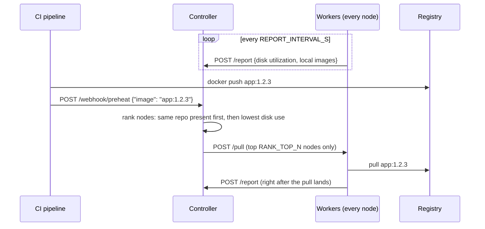
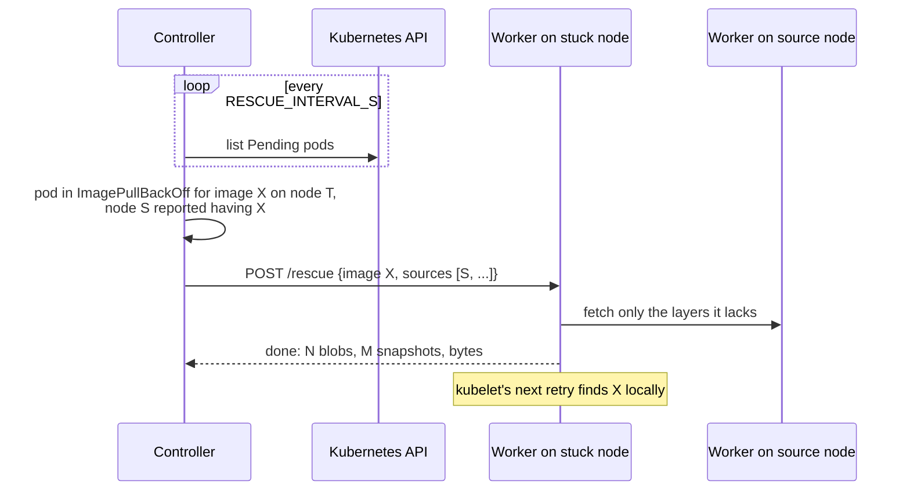
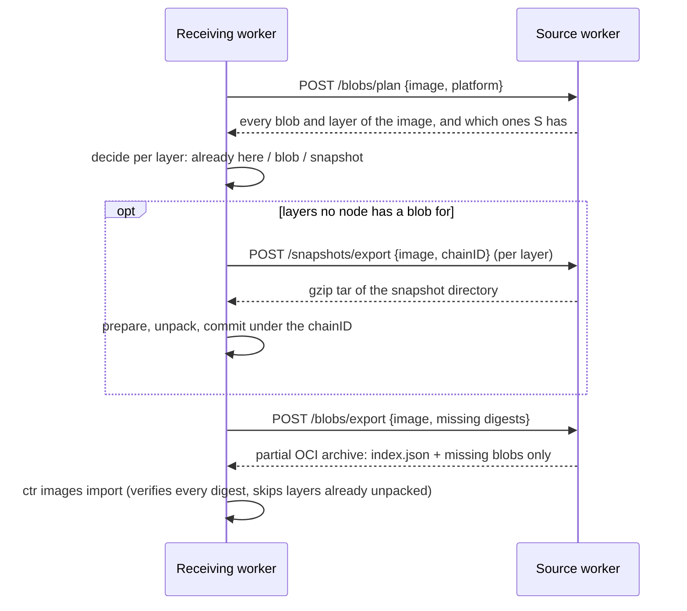

# 🦆🔪 Angry Duck

**Get freshly pushed container images onto every Kubernetes node, while the registry serves them only a couple of times, and unstick pods whose image can't be pulled.**

When CI pushes a new image, Angry Duck has a few well-chosen nodes pull it
from the registry, then spreads it from those nodes to the rest of the fleet,
node to node. By the time your deployer schedules the new pods, the image is
already local. And when a pod gets stuck in `ImagePullBackOff` because a node
can't reach the registry, or the registry no longer has the image, Angry Duck
copies the image to that node from another node that has it.

- **Preheat.** On push, it picks the best `RANK_TOP_N` nodes to pull from the
  registry. It prefers nodes with an older tag of the same repo (a small
  delta), then the ones with the most free disk.
- **Propagation.** Every other eligible node then gets the image from its
  peers, fanning out like a tree, with bounded load and a disk-usage guard.
- **Rescue.** Pods stuck on a pull are fixed from peers, for any image, not
  only pushed ones.
- **Only what's missing.** A transfer skips every layer the receiver already
  has, and works even when the source only has the image unpacked (layer
  blobs discarded).
- **Small.** Two static Go binaries with no external Go dependencies. It runs
  the node's own `crictl`, `ctr` and `tar` through a chroot, so no runtime
  binaries ship in the image.
- **Observable.** Prometheus metrics on both components, ServiceMonitors,
  and a `/status` endpoint showing every stuck pull and every image being
  spread.

---

## Contents

- [How it works](#how-it-works)
  - [Preheat](#preheat)
  - [Propagation](#propagation)
  - [ImagePullBackOff rescue](#imagepullbackoff-rescue)
  - [How images move between nodes](#how-images-move-between-nodes)
- [What it is not](#what-it-is-not)
- [Requirements](#requirements)
- [Deploy to Kubernetes](#deploy-to-kubernetes)
- [Hook it into CI](#hook-it-into-ci)
- [Configuration](#configuration)
- [Operating it](#operating-it)
- [API](#api)
- [Metrics](#metrics)
- [Security considerations](#security-considerations)
- [Image cleanup](#image-cleanup)
- [Development](#development)
- [Version history](#version-history)

---

## How it works

Angry Duck has two parts:

| Component | Runs as | Job |
|---|---|---|
| **Controller** | Deployment (1 replica) | Receives the preheat webhook, tracks every node's disk usage and images, picks which nodes pull, orders node-to-node transfers, and watches for pods stuck on pulls. |
| **Worker** | DaemonSet (1 per node) | Reports its node, pulls when told to, and sends or receives images to and from other workers. |

An image's life after a push:

1. **Preheat:** `RANK_TOP_N` nodes pull it from the registry.
2. **Propagation:** every other eligible node gets it from those nodes, and
   from each other, for up to `PROPAGATE_WINDOW_S`.
3. **Rescue:** if a pod ever gets stuck pulling it anyway, it is copied to
   that node from a node that has it.
4. **Cleanup:** kubelet removes it from nodes that don't use it (see
   [Image cleanup](#image-cleanup)).

### Preheat



How nodes are ranked and ordered:

1. Only **fresh** workers count, meaning ones that reported within
   `WORKER_STALE_AFTER_S`. If no worker is fresh, the webhook returns `503`
   rather than guessing.
2. Nodes that match `RANK_EXCLUDE_NODE_SUBSTRINGS` (for example `master`) are
   never picked. They still run a worker and still report.
3. Nodes that already have **some tag of the same repo** come first. You can
   turn this off with `RANK_PREFER_IMAGE_LOCALITY=false`.
4. Ties are broken by **lowest disk utilization**, from node-exporter.
5. Exactly `RANK_TOP_N` nodes are ordered per image, and the same image is
   never re-ordered. If an order fails, the controller replaces that node on
   its next tick, until `TARGET_TTL_S` runs out.

### Propagation

Once a preheat seed reports the image, the controller keeps spreading it
until every eligible node has it, or `PROPAGATE_WINDOW_S` runs out:

1. Every `PROPAGATE_INTERVAL_S`, each node that lacks the image is paired
   with a node that has it, and its worker is ordered to fetch it (see
   [How images move between nodes](#how-images-move-between-nodes)).
2. Each node that receives it becomes a source, so the image spreads like a
   tree: 2 seeds, then 6 nodes, then 18. Each node is ordered only once.

It is built to stay light:

- **Bounded load:** a node serves at most `PROPAGATE_PER_SOURCE` transfers
  at once, and at most `PROPAGATE_MAX_CONCURRENT` run cluster-wide. Rescues
  have their own slots, so propagation can't delay a stuck pod.
- **Disk-aware:** nodes above `PROPAGATE_MAX_UTILIZATION` are skipped, so
  propagation never pushes a node into kubelet's disk-pressure GC. Nodes
  matching `PROPAGATE_EXCLUDE_NODE_SUBSTRINGS` (by default the same list as
  preheat) are skipped too; rescue still covers them.
- **Retries back off:** a node whose transfer fails is retried with the same
  exponential backoff as rescue.

### ImagePullBackOff rescue

Sometimes a node can't pull an image from the registry, because of a broken
route or firewall rule, or because the image was deleted upstream, while
the image is sitting on other nodes. The rescuer handles that, for any
image, pushed through Angry Duck or not:



Things to know:

- **It doesn't restart pods.** The pod starts on kubelet's next backoff
  retry, at most 5 minutes later. Delete the pod to skip the wait.
- **`imagePullPolicy: Always` is skipped.** kubelet goes to the registry for
  those even when the image is local. This includes `:latest` and untagged
  images, which default to `Always`.
- **Failures back off.** Each failure in a row for the same node and image
  doubles the wait, from `RESCUE_RETRY_AFTER_S` up to `RESCUE_BACKOFF_MAX_S`,
  and resets once the pod is no longer stuck. A retry skips anything that
  already arrived.
- **It can't rescue the Angry Duck worker itself.** The worker on the stuck
  node is what receives, so if the worker's own image is the one stuck,
  nothing is there to fix it. See
  [Bootstrapping a node by hand](#bootstrapping-a-node-by-hand).

### How images move between nodes

Rescue and propagation use the same transfer. The controller tells the
receiving worker which image to get and from which peers, and the receiver
does the rest:



- The **source** walks the image the way containerd does on a pull: index,
  then the manifest for the receiver's platform, then config and layers.
  Attestation manifests and other platforms are skipped.
- The **receiver** decides per layer, the way containerd's own pull does. A
  layer whose unpacked snapshot (named by its chainID) is already on the node
  needs nothing, not even its blob. Otherwise it gets the compressed
  **blob**, from its own store or the source's. If no blob exists anywhere,
  it gets the source's **snapshot**.
- **Blobs** travel in one partial OCI archive streamed straight into
  `ctr images import`. containerd checks every blob against its digest and
  size, so a broken transfer fails the import instead of landing a bad image.
- **Snapshots** exist because a node can run an image with none of its layer
  blobs: with `discard_unpacked_layers = true`, containerd deletes them after
  unpacking, and it never downloads a layer whose snapshot already exists. A
  blob can't be rebuilt from a snapshot with the same digest, so the snapshot
  directory itself is shipped. The node's `tar` keeps ownership, overlayfs
  deletion markers and `trusted.overlay.*` attributes, fast gzip compresses
  it on the wire, and the receiver commits it under the layer's chainID. The
  import that follows finds those chainIDs and skips the layers. A snapshot
  needs its parent to exist first, so once one layer goes by snapshot, every
  missing layer below it does too.
- **Integrity:** snapshots can't be verified against a digest, since the tar
  bytes never match the original layer. They rely on the token-authenticated
  peer, TCP and gzip's CRC-32, checked before each commit. Keeping
  `discard_unpacked_layers = false` lets verified blobs, about a third the
  size, be used whenever possible.
- **Interruptions:** snapshots from a failed attempt stay pinned against
  containerd's GC for `RESCUE_PIN_TTL_S`, so a retry doesn't ship them again.
  A restarted worker removes leftover temporary snapshots and releases
  expired pins.

## What it is not

- **It is not a registry mirror.** It spreads the images announced through
  the preheat webhook, and rescues any image once a pod is stuck on it. It
  doesn't sit in front of containerd, so images never announced
  (third-party images, for example) are still pulled from their registry by
  each node that needs them, until a pull fails. A pull-through mirror such
  as [Spegel](https://github.com/spegel-org/spegel) covers every image, if
  you need that.
- **It is not an image garbage collector.** It never deletes images; kubelet
  does. See [Image cleanup](#image-cleanup).

## Requirements

- Kubernetes **1.30+**, because the worker uses the
  `securityContext.appArmorProfile` field.
- containerd on every node, with its default `overlayfs` snapshotter.
  `crictl` (recommended) for preheat pulls; `ctr` and `docker` are also
  supported. Rescue and propagation need `ctr` and GNU `tar` on the node,
  whatever `CONTAINER_RUNTIME` is set to.
- **node-exporter** running with host networking on every node, on
  `localhost:9100` by default.
- Workers reachable from each other and from the controller on port `18081`
  of the node network.
- kubelet image GC configured for your disk budget. With propagation on,
  this matters; see [Image cleanup](#image-cleanup).
- For private registries, a `dockerconfigjson` secret with pull credentials.
- Optional: the Prometheus Operator, for the included ServiceMonitors.

## Deploy to Kubernetes

The manifests in `deploy/` are two example environments (`stg`, `mgmt`) that
differ only in labels and the ingress host. Copy one and adjust it for your
cluster. The commands below use `stg`.

**1. Build and push the images.**

```bash
cd app
```

```bash
sudo docker build -t registry.example.com/devops/generic/angry-duck-controller:1.8.0 -f Dockerfile.controller .
```

```bash
sudo docker build -t registry.example.com/devops/generic/angry-duck-worker:1.8.0 -f Dockerfile.worker .
```

```bash
sudo docker push registry.example.com/devops/generic/angry-duck-controller:1.8.0
```

```bash
sudo docker push registry.example.com/devops/generic/angry-duck-worker:1.8.0
```

If you use another registry or tag, update the `image:` fields in
`deploy/stg/deployment-controller.yaml` and `deploy/stg/daemonset-worker.yaml`.

**2. Create the namespace:**

```bash
sudo kubectl apply -f deploy/stg/namespace.yaml
```

**3. Create the secrets.** The manifests expect three:

| Secret | Used by | Holds |
|---|---|---|
| `gitlab-docker-registry` | both, as `imagePullSecrets` | Credentials for kubelet to pull the Angry Duck images. |
| `gitlab-registry-pull` | worker, mounted as a file | Credentials for preheat pulls (`REGISTRY_CREDENTIALS_PATH`). |
| `angryduck-rescue-token` | both, mounted as a file | The shared token for rescue and propagation. Without it, both stay off. |

The two registry secrets can hold the same credentials:

```bash
sudo kubectl -n angryduck create secret docker-registry gitlab-docker-registry --docker-server=registry.example.com --docker-username=<user> --docker-password=<password>
```

```bash
sudo kubectl -n angryduck create secret docker-registry gitlab-registry-pull --docker-server=registry.example.com --docker-username=<user> --docker-password=<password>
```

```bash
sudo kubectl -n angryduck create secret generic angryduck-rescue-token --from-literal=token=$(openssl rand -hex 32)
```

**4. Review the config** in `deploy/stg/configmap-env.yaml`. The values most
worth checking are `RANK_EXCLUDE_NODE_SUBSTRINGS`,
`PROPAGATE_MAX_UTILIZATION` (keep it below kubelet's
`imageGCHighThresholdPercent`), `CONTAINER_RUNTIME` and `NODE_EXPORTER_URL`.

**5. Apply everything.** This includes the ServiceMonitors; delete
`servicemonitor-*.yaml` first if you don't run the Prometheus Operator.

```bash
sudo kubectl apply -f deploy/stg/
```

**6. Check that it's working:**

```bash
sudo kubectl -n angryduck get pods -o wide
```

```bash
sudo kubectl -n angryduck logs deploy/angryduck-controller | grep -E 'rescuer started|propagator started|WARNING'
```

```bash
sudo kubectl -n angryduck port-forward svc/angryduck-controller 8080:8080
```

```bash
curl -s http://localhost:8080/status | jq '{fresh_count, workers: [.workers[] | {node_id, fresh}]}'
```

Every node should show `"fresh": true`, and the controller log should show
the rescuer and propagator starting with no warnings.

**7. Expose the webhook.** Edit the host in
`deploy/stg/ingress-controller-webhook.yaml`. The ingress exposes only
`/angryduck/webhook/preheat`. Read
[Security considerations](#security-considerations) before making it
reachable.

## Hook it into CI

Call the webhook right after `docker push`. Treat it as best-effort, so a
failed preheat never fails the pipeline:

```bash
curl -fsS -X POST https://angryduck-stg.example.com/angryduck/webhook/preheat -H 'Content-Type: application/json' -d "{\"image\":\"${IMAGE}\"}" || true
```

The response tells you which nodes were ordered to pull. Propagation to the
rest starts on its own once they have it.

```json
{"accepted": true, "target_image": "registry.example.com/app:1.2.3", "ordered_nodes": ["node-7", "node-3"]}
```

## Configuration

Everything is set through environment variables. In Kubernetes these come
from the ConfigMap; locally they can come from a `.env` file, and real
environment variables always win over the file. Every option is documented in
[`app/.env.example`](app/.env.example). The ones you're most likely to change:

**Preheat**

| Variable | Default | What it does |
|---|---|---|
| `RANK_TOP_N` | `2` | How many nodes pull each pushed image from the registry. |
| `RANK_PREFER_IMAGE_LOCALITY` | `true` | Prefer nodes that already have some tag of the same repo. |
| `RANK_EXCLUDE_NODE_SUBSTRINGS` | *(empty)* | Nodes never to pull on, e.g. `master,control-plane`. |
| `TARGET_TTL_S` | `120` | How long the controller keeps replacing failed pull orders for an image. |

**Propagation**

| Variable | Default | What it does |
|---|---|---|
| `PROPAGATE_ENABLED` | `true` | Spread each preheated image to every eligible node. Needs the token. |
| `PROPAGATE_WINDOW_S` | `3600` | How long after a push to keep spreading it. |
| `PROPAGATE_MAX_UTILIZATION` | `0.70` | Skip nodes whose disk is fuller than this. |
| `PROPAGATE_PER_SOURCE` | `2` | Transfers one node serves at once. |
| `PROPAGATE_MAX_CONCURRENT` | `4` | Transfers in flight across the cluster. |
| `PROPAGATE_EXCLUDE_NODE_SUBSTRINGS` | same as `RANK_EXCLUDE_NODE_SUBSTRINGS` | Nodes to leave out. |

**Rescue**

| Variable | Default | What it does |
|---|---|---|
| `RESCUE_ENABLED` | `true` | Rescue pods stuck on pulls. Needs the token. |
| `RESCUE_TOKEN_PATH` | `/etc/angryduck/rescue-token/token` | Shared token file, at least 32 characters. Also used by propagation. |
| `RESCUE_RETRY_AFTER_S` | `120` | Wait before retrying the same node and image; doubles after each failure. |
| `RESCUE_BACKOFF_MAX_S` | `3600` | Cap for that doubling. |
| `RESCUE_PIN_TTL_S` | `3600` | How long snapshots from a failed attempt are kept for the retry. |

**Nodes and runtime**

| Variable | Default | What it does |
|---|---|---|
| `WORKER_STALE_AFTER_S` | `30` | How long before a silent worker is ignored. |
| `REPORT_INTERVAL_S` | `15` | How often each worker reports. |
| `CONTAINER_RUNTIME` | `crictl` | `crictl` (recommended), `containerd` (`ctr`), or `docker`. |
| `CONTAINER_RUNTIME_ENDPOINT` | `unix:///run/containerd/containerd.sock` | The containerd socket, as a path on the **node**. |
| `HOST_ROOT` | `/proc/1/root` | Where the node's root filesystem is visible. Use `/` for local runs. |
| `NODE_EXPORTER_URL` | `http://localhost:9100/metrics` | Where the worker reads disk usage. |
| `REGISTRY_CREDENTIALS_PATH` | *(empty)* | Path to a `dockerconfigjson` for preheat pulls from private registries. |
| `LOG_LEVEL` | `info` | One of `debug`, `info`, `warn`, `error`. |

> **Why `crictl`?** With `ctr`, listing running containers takes one
> subprocess per container. On busy nodes that is enough to push the worker
> past its CPU limit. `crictl` does the same job in a single call.

## Operating it

### Watching it

The controller's `GET /status` is the quickest view:

```bash
curl -s http://localhost:8080/status | jq '.rescues'
```

```bash
curl -s http://localhost:8080/status | jq '.propagations[] | {image, have: (.have|length), missing, in_flight, failing}'
```

`rescues` lists every image a node currently can't pull, with its pods, last
result or error, failures in a row and next attempt. `propagations` lists
each image being spread, with the nodes that have it, are missing it, are
receiving it, were skipped, or are failing.

Controller and worker logs describe every decision in one line each; grep
for `rescuer:`, `propagator:` or `rescue image=`.

### Bootstrapping a node by hand

A node's worker can't receive its own image, so if a node can't reach the
registry, a new Angry Duck version gets stuck there, and the DaemonSet
rollout stops at that node. Copy the worker image to it by hand, using a
healthy worker as the source. This uses the blob path, so pick a source that
has the blobs:

```bash
sudo -v; IMG=registry.example.com/devops/generic/angry-duck-worker:1.8.0; SRC=<healthy-node-ip>:18081; TOKEN=<token from the angryduck-rescue-token secret>
```

```bash
curl -sSf -H "Authorization: Bearer $TOKEN" -d "{\"image\":\"$IMG\",\"platform\":\"linux/amd64\"}" http://$SRC/blobs/plan > /tmp/plan.json && jq -r '.blobs[] | "\(.digest) \(.size)"' /tmp/plan.json
```

```bash
sudo ctr -n k8s.io content ls -q > /tmp/have.txt && MISSING=$(jq -c --rawfile have /tmp/have.txt '[.blobs[].digest] - ($have | split("\n"))' /tmp/plan.json) && echo "$MISSING" | jq length
```

```bash
curl -sSf -H "Authorization: Bearer $TOKEN" -d "{\"image\":\"$IMG\",\"platform\":\"linux/amd64\",\"digests\":$MISSING}" http://$SRC/blobs/export | sudo ctr -n k8s.io images import --platform linux/amd64 /dev/stdin
```

Then delete the stuck worker pod so the DaemonSet recreates it with the
image already local. Better still, do this **before** applying a new version
to a cluster with such a node.

## API

**Controller** (port `8080`):

| Endpoint | Description |
|---|---|
| `POST /webhook/preheat` | Body: `{"image": "..."}`. Returns `202` with the ordered nodes, or `503` if no worker is fresh. Short names are normalized, so `nginx` becomes `docker.io/library/nginx:latest`. Also starts propagation. |
| `POST /report` | Called by workers. |
| `GET /status` | Every known worker, the current preheat target, stuck pulls (`rescues`) and active `propagations`. |
| `GET /metrics` | Prometheus metrics. |
| `GET /healthz` | Liveness and readiness check. |

**Worker** (port `18081`, on the node's network). All endpoints except
`/pull`, `/metrics` and `/healthz` require the shared token as a bearer
token.

| Endpoint | Called by | Description |
|---|---|---|
| `POST /pull` | controller | Body: `{"image": "...", "ordered_at": "..."}`. Returns `202` and pulls from the registry in the background. |
| `POST /rescue` | controller | Body: `{"image": "...", "sources": [{"node_id", "address"}], "reason": "rescue\|propagate"}`. Copies the image from the first source that works and returns the result. |
| `POST /blobs/plan` | peer | Body: `{"image", "platform"}`. Lists every blob and layer of the image for that platform, and which ones this node has. |
| `POST /blobs/export` | peer | Body: `{"image", "platform", "digests"}`. Streams a partial OCI archive with only those blobs. |
| `POST /snapshots/export` | peer | Body: `{"image", "platform", "chain_id"}`. Streams one layer's snapshot directory as a gzip tar. |
| `GET /metrics` | Prometheus | Prometheus metrics. |
| `GET /healthz` | kubelet | Liveness and readiness check. |

## Metrics

**Controller**

| Metric | Type | Labels | Meaning |
|---|---|---|---|
| `angryduck_controller_pull_orders_total` | counter | `node`, `result`, `registry` | Preheat pull orders sent to workers, and whether each was accepted. |
| `angryduck_controller_propagations_total` | counter | `result` | Finished propagations: `complete` or `expired`. |
| `angryduck_controller_propagation_transfers_total` | counter | `node`, `result` | Transfers ordered while spreading pushed images. |
| `angryduck_controller_propagation_nodes` | gauge | `image`, `state` | Nodes per image being spread: `have`, `missing`, `in_flight`, `skipped`. |
| `angryduck_controller_rescues_total` | counter | `node`, `result` | Rescue decisions: `success`, `failure`, `no_source`, `no_target`, `pull_policy_always`. |
| `angryduck_controller_rescue_stuck_images` | gauge | `node` | Images each node currently can't pull. |
| `angryduck_controller_rescue_consecutive_failures` | gauge | `node`, `image` | Failed rescue attempts in a row, for stuck pairs with at least one failure. |
| `angryduck_controller_rescues_in_flight` | gauge | | Rescues running right now. |

**Worker**

| Metric | Type | Labels | Meaning |
|---|---|---|---|
| `angryduck_worker_pulls_total` | counter | `node`, `result`, `registry` | Preheat pulls executed, and whether they succeeded. |
| `angryduck_worker_pull_duration_seconds` | gauge | `node`, `result`, `registry`, `image`, `spegel` | Duration of the most recent preheat pull per repo. Cleared every `PULL_DURATION_RESET_INTERVAL_S`. |
| `angryduck_worker_preheated_containers_running` | gauge | `node`, `repo` | Running containers whose repo was recently preheated on that node: a rough "is preheat paying off" signal. |
| `angryduck_worker_rescues_total` | counter | `node`, `reason`, `result` | Images this node fetched from a peer. `reason`: `rescue` or `propagate`; `result`: `success`, `failure`, `already_present`. |
| `angryduck_worker_rescue_bytes_total` | counter | `node`, `direction` | Bytes moved between nodes (blobs and compressed snapshots), `served` or `received`. |
| `angryduck_worker_rescue_layers_total` | counter | `node`, `method` | Layers of fetched images by how they arrived: `present`, `blob`, `snapshot`. |
| `angryduck_worker_rescue_pinned_snapshots` | gauge | `node` | Shipped snapshots still pinned for a retry. |
| `angryduck_worker_rescue_cleanups_total` | counter | `node`, `kind` | Leftovers removed: `temp_snapshot`, `expired_pin`. |

`registry` is only filled in when `METRICS_LABEL_REGISTRY=true`, and `spegel`
only when `SPEGEL_IMAGE_SUBSTRING` is set.

Suggested alerts:

```promql
# A rescue has failed 3+ times in a row for the same node and image.
angryduck_controller_rescue_consecutive_failures >= 3

# A node can't pull an image, and no node has it to rescue from.
increase(angryduck_controller_rescues_total{result=~"no_source|no_target"}[30m]) > 0
  and on(node) angryduck_controller_rescue_stuck_images > 0

# Pushed images are not reaching every eligible node within their window.
increase(angryduck_controller_propagations_total{result="expired"}[1h]) > 0

# Most rescued layers arrive as snapshots: check discard_unpacked_layers.
sum(rate(angryduck_worker_rescue_layers_total{method="snapshot"}[1d]))
  / sum(rate(angryduck_worker_rescue_layers_total{method=~"blob|snapshot"}[1d])) > 0.5
```

## Security considerations

Read these before you deploy.

- **The worker is powerful on its node, though not `privileged: true`.** It
  runs with `hostPID`, `hostNetwork`, an unconfined AppArmor profile, and
  these capabilities (all others dropped):
  - `SYS_CHROOT` and `SYS_PTRACE`, to chroot into `/proc/1/root` and run the
    node's own `crictl`, `ctr` and `tar`. Without the AppArmor setting,
    reading `/proc/1/root` fails with `permission denied` on
    AppArmor-enforcing nodes such as Ubuntu.
  - `DAC_READ_SEARCH`, `DAC_OVERRIDE`, `CHOWN`, `FOWNER`, `FSETID`,
    `SETFCAP`, `MKNOD` and `SYS_ADMIN`, so snapshot shipping can read and
    write overlayfs directories faithfully.

  The worker can drive containerd through its socket, which is already
  root-equivalent on the node, so the extra capabilities add no new level of
  trust. It is still a real blast radius: pin and sign the image.
- **Workers serve image content to each other.** `/blobs/*` and
  `/snapshots/*` hand out layers of any image on the node, private ones
  included, to whoever holds the shared token. Without the token, rescue and
  propagation stay off instead of serving unauthenticated. Traffic is plain
  HTTP on the node network. Rotating the token means updating the Secret and
  restarting the controller and all workers.
- **The controller can list every pod in the cluster.** Rescue needs that to
  find stuck pulls. It has no other Kubernetes API access.
- **Preheat pulls bypass `imagePullSecrets`.** The worker runs the runtime CLI
  directly, so it only has the credentials in `REGISTRY_CREDENTIALS_PATH`.
- **The preheat webhook and `/pull` have no built-in authentication.**
  Protect them yourself:
  - Restrict the webhook ingress to your CI runners, for example with an IP
    allowlist annotation on your ingress controller.
  - Consider a NetworkPolicy so only the controller and other workers can
    reach port `18081`.

## Image cleanup

Angry Duck never deletes images. Cleanup is kubelet's job, because kubelet is
the component that decides `DiskPressure` and knows which images are in use.
Two `KubeletConfiguration` settings cover it:

- `imageGCHighThresholdPercent` / `imageGCLowThresholdPercent`:
  capacity-based cleanup of the least-recently-used unused images.
- `imageMaximumGCAge`: time-based cleanup of images unused for longer than a
  set duration. It is on by default since Kubernetes 1.30; check the docs for
  your version.

With propagation on, every eligible node receives each pushed image whether
it runs it or not, so these settings are what keeps disks in check. For
example:

```yaml
# KubeletConfiguration
imageMaximumGCAge: 24h           # drop images no container has used for a day
imageGCHighThresholdPercent: 75  # above 75% disk, delete unused images...
imageGCLowThresholdPercent: 65   # ...least recently used first, down to 65%
```

Keep `PROPAGATE_MAX_UTILIZATION` below `imageGCHighThresholdPercent` (0.70
against 75 here). Otherwise propagation fills a node, kubelet deletes the
unused images, and the next push fills it again.

## Development

```text
app/
├── cmd/controller/       controller entrypoint
├── cmd/worker/           worker entrypoint
└── internal/
    ├── controller/       worker registry, ranking, propagator, rescuer, HTTP server
    ├── worker/           reporter, puller, rescue endpoints, snapshot pins, runtime backends, host exec
    ├── blobship/         image walk, per-layer decisions, partial OCI archives
    ├── kube/             minimal in-cluster client (list pods)
    ├── sharedtoken/      bearer token shared by controller and workers
    ├── imageref/         image reference parsing / normalization
    ├── registryauth/     dockerconfigjson credential lookup
    ├── metrics/          tiny Prometheus text-format registry
    ├── memlimit/         sets GOMEMLIMIT from the cgroup limit
    ├── logging/          leveled logging
    ├── config/           .env loader + typed getters
    └── model/            wire types shared by both binaries
deploy/                   example Kubernetes manifests per environment
```

Run the tests:

```bash
cd app && go test -race ./...
```

A few tests need root and are skipped otherwise:
`TestHostExec_RealChrootExecution` performs a real `chroot(2)`, and
`TestSnapshotRoundTrip_RealTar` checks that device files, ownership and
`trusted.*` attributes survive a snapshot round trip through the real `tar`.
The transfer logic is tested end to end over HTTP against an in-memory
content store (`blobship.MemStore`) that mimics containerd's import and
unpack behavior.

## Version history

| Version | Change |
|---|---|
| 1.8.0 | Propagation: pushed images spread to every eligible node from peers. |
| 1.7.1 | Rescue backoff, pins kept across retries, startup cleanup, `/status` for rescues, more metrics. |
| 1.7.0 | Snapshot shipping, so rescue works when no node has the layer blobs; per-layer decisions skip layers already unpacked. |
| 1.6.1 | Sources report which blobs they lack instead of refusing. |
| 1.6.0 | Rescue rebuilt: node-to-node transfer of only the missing blobs. |
| 1.5.0 | Removed image GC and the old rescue; preheat only. |
| ≤ 1.4.x | Preheat, image GC and an earlier rescue. |