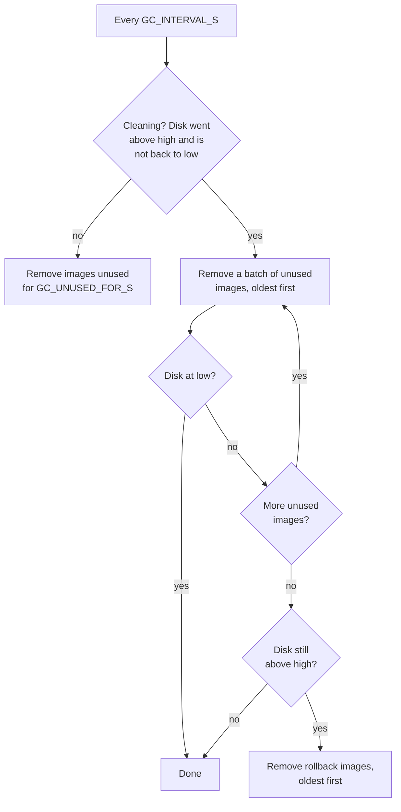

# Image cleanup

Each worker cleans up its own node's images, well before kubelet's
disk-pressure image GC would, and with more knowledge of which images matter.

## Rules

An image that isn't in use on the node is removed when **either** of these
holds:

- **It has been unused for `GC_UNUSED_FOR_S`** (6 hours), whatever the disk
  usage. The clock starts from the last time a container ran it on this node,
  or from when the node got it if it never ran there, for example after
  propagation.
- **The disk is above `GC_HIGH_UTILIZATION`** (70%). Unused images are then
  removed oldest first, however recently they ran, until the disk is back
  down to `GC_LOW_UTILIZATION` (60%).



## Rollback images

Per repo, the newest `GC_ROLLBACK_KEEP` (3) unused images are kept so a
rollback starts instantly. The 6-hour rule never removes them. Disk pressure
removes them only after every other candidate is gone and the disk is still
above the high mark.

## Never removed

- images in use on the node: a running container uses it, or a container of
  a pod that is still up does. A crashlooping container is exited most of the
  time, but kubelet restarts it from the same image, so its image stays. A
  completed Job's image doesn't: its pod is no longer up;
- images being pulled or received right now;
- a rescue's temporary base images;
- images whose name contains a `GC_PROTECT_SUBSTRINGS` entry (`pause` by
  default).

## Mechanics

- Usage is sampled every `GC_INTERVAL_S`. Usage times are saved under
  `RESCUE_STATE_DIR` on the node, so a worker restart doesn't make old images
  look new.
- Images are removed in batches of `GC_BATCH`. Under disk pressure, the worker
  waits `GC_SETTLE_S` after each batch for containerd to free the space, then
  measures again.
- Every name of an image (tag, `repo@digest`, image ID) is removed together,
  so containerd's garbage collector really frees its layers. Layers shared
  with images that stay are kept.

## Working with kubelet and propagation

Keep the thresholds in this order:

```text
PROPAGATE_MAX_UTILIZATION  ≤  GC_HIGH_UTILIZATION  <  kubelet imageGCHighThresholdPercent
```

Nodes that fill up are skipped by propagation, cleaned down to the low mark,
and then receive the image. kubelet's image GC stays as the last line of
defense.

## Metrics

| Metric | Meaning |
|---|---|
| `angryduck_worker_gc_images_deleted_total{tier}` | `old` (unused past `GC_UNUSED_FOR_S`), `pressure` (removed early for disk space), `rollback`, or `error`. |
| `angryduck_worker_gc_image_returns{image}` | Images that came back within an hour of being removed, and how often: something still uses them. Only the last hour is kept. |
| `angryduck_worker_gc_candidates{tier}` | Images that could be removed right now, per tier. |
| `angryduck_worker_gc_cleaning` | 1 while the disk is above high and not yet back to low. |

A node with `gc_cleaning == 1` and no candidates in any tier is full of
running or protected images; cleanup can't help it.

## Settings

`GC_ENABLED`, `GC_INTERVAL_S`, `GC_UNUSED_FOR_S`, `GC_HIGH_UTILIZATION`,
`GC_LOW_UTILIZATION`, `GC_ROLLBACK_KEEP`, `GC_BATCH`, `GC_SETTLE_S`,
`GC_PROTECT_SUBSTRINGS`. See [Configuration](configuration.md#image-cleanup).
