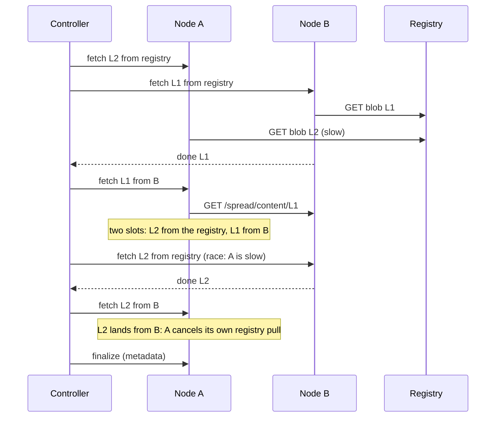

# Propagation

Once CI pushes an image, Angry Duck puts it on every eligible node. Since
1.8.8 it does this **blob by blob**: every layer starts spreading between
nodes the moment any node has it, the registry serves each layer about
once, and no node waits for another to finish a whole image.

## How a push spreads

The controller reads the image's manifest and config from its registry (a
few KB, the same read [preheat](preheat.md) ranking uses), then keeps a
board of every layer: which nodes hold its blob, which are pulling it from
the registry, and which are receiving it from a peer.

Each node has **two slots**: one blob from the registry (north-south) and
one blob from a peer (east-west), at a time. Whenever a transfer ends, the
controller fills free slots, about a second later:

- **East-west first.** A node lacking a layer that some node holds fetches
  it from that node. The rarest layer goes first (fewest holders), so new
  sources appear where they are scarcest. A source serves
  `PROPAGATE_PER_SOURCE` transfers at a time, and `PROPAGATE_MAX_CONCURRENT`
  run cluster-wide.
- **The registry only for what nobody has.** A registry pull is ordered
  only for a layer no node holds yet, by at most
  `SPREAD_MAX_REGISTRY_PULLS` nodes at once (default: `RANK_TOP_N`). Nobody
  pulling a layer comes first, the largest first.
- **No waiting on promises.** When every layer nobody holds is already
  being pulled, an idle node races the pull that has run longest, at most
  `SPREAD_RACE_PER_BLOB` (2) pulls per layer. A node with a bad route to the
  registry can't hold a heavy layer hostage.
- **Races end on the receiving node.** A node pulling a layer from the
  registry still gets it pushed from a peer as soon as a peer has it. When
  either copy lands, the worker cancels the other right away, by itself.
  Sometimes the registry is the slow path, sometimes the peer: the faster
  one wins.
- **Registering the image.** When a node holds every layer (its blob, or
  its unpacked snapshot), the controller sends it the image's metadata it
  read from the registry, checked against its digests on arrival, and the
  node registers and unpacks the image. Kubelet then finds it locally.

Receivers are served in this order: nodes where a pod is already waiting
for the image, then the nodes that lack the fewest bytes.



## Blobs held until the image exists

Blobs arrive long before the image that references them, so each job's
blobs are held by a containerd lease on the node. The lease expires after
an hour on its own, so a crash or an abandoned job frees its blobs without
cleanup; a longer job moves them to a fresh lease halfway. Registering the
image ends the lease: from then on the image holds its blobs. A superseded
or expired job tells its nodes to drop theirs.

While a spread runs, the node's [mirror](mirror.md) already serves the
blobs it holds, so a pod scheduled there before the image is registered
pulls those layers locally.

## Fallbacks

- **No layer list.** If the image's manifest can't be read (no credentials
  for that registry, say), the push is seeded and propagated **whole**, as
  before 1.8.8: `RANK_TOP_N` seeds pull the image, then nodes copy it from
  each other, each holder serving one node at a time so holders double each
  round. `SPREAD_ENABLED=false` or `RANK_BY_LAYERS=false` always works this
  way.
- **A layer the registry keeps failing on.** After three failed registry
  pulls of one layer, if some node has the whole image (holding that layer
  only as an unpacked snapshot, for instance), nodes lacking it get the whole
  image from there, [snapshots](transfers.md#snapshots) included. Without
  such a node, the registry is retried with backoff.

## Limits that apply

- Nodes matching `PROPAGATE_EXCLUDE_NODE_SUBSTRINGS` never receive, but do
  serve what they hold.
- Nodes above `PROPAGATE_MAX_UTILIZATION` get nothing new until
  [image cleanup](image-cleanup.md) brings them down; the spread waits for
  them unless `PROPAGATE_WINDOW_S` is set.
- A node that fails backs off `SPREAD_RETRY_AFTER_S`, doubling up to
  `SPREAD_BACKOFF_MAX_S`.
- A transfer runs at most `SPREAD_TRANSFER_TIMEOUT_S`. A worker that never
  reports back has its slot freed a minute later.
- A newer tag of the same repo supersedes the spread.

## Watching it

```bash
curl -s localhost:8080/status | jq '.spreads[] | {image, done: (.done|length), nodes: [.nodes[] | {node, missing_layers, registry, peer, peer_from}]}'
```

The dashboard's **Spread** tab shows every running spread, what each node
still lacks, and every transfer moving right now. See
[Observability](observability.md#spread) for the metrics.

## Settings

`SPREAD_ENABLED`, `SPREAD_MAX_REGISTRY_PULLS`, `SPREAD_RACE_PER_BLOB`,
`SPREAD_RETRY_AFTER_S`, `SPREAD_BACKOFF_MAX_S`, `SPREAD_TRANSFER_TIMEOUT_S`,
and from propagation `PROPAGATE_INTERVAL_S`, `PROPAGATE_WINDOW_S`,
`PROPAGATE_MAX_CONCURRENT`, `PROPAGATE_PER_SOURCE`,
`PROPAGATE_MAX_UTILIZATION`, `PROPAGATE_EXCLUDE_NODE_SUBSTRINGS`. The
whole-image fallback also uses `PROPAGATE_ENABLED` and
`PROPAGATE_SEED_TIMEOUT_*`. Spreading needs the shared token. See
[Configuration](configuration.md#spread).
