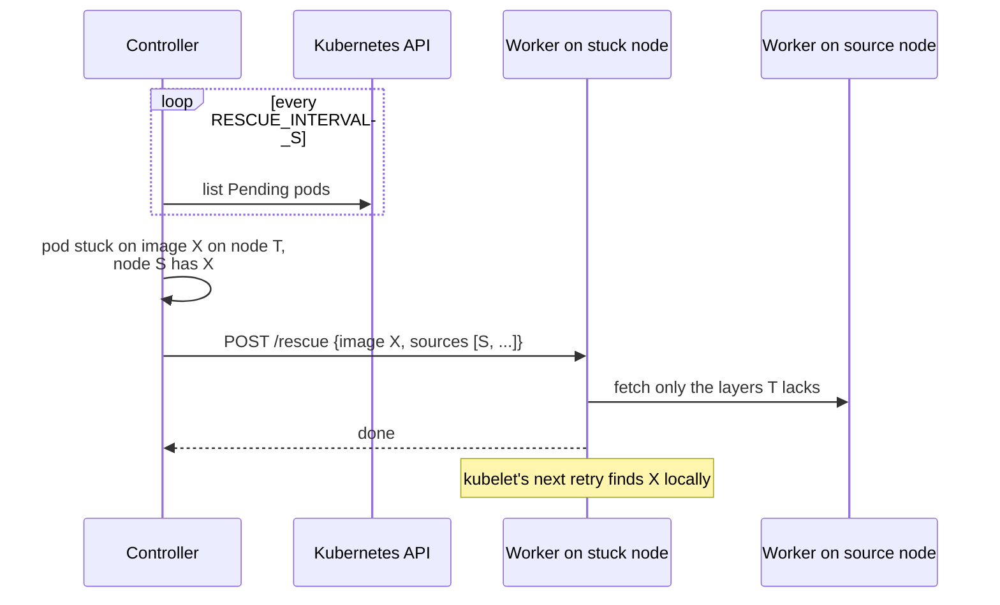

# Rescue

Sometimes a node can't pull an image from the registry, because of a broken
route or firewall rule, a registry outage, or an image deleted upstream, while
the same image is sitting on other nodes. The rescuer copies it over. It works
for any image, whether or not it was preheated.



## Behavior

- **Detection.** Every `RESCUE_INTERVAL_S`, the controller lists Pending pods
  and finds containers in `ImagePullBackOff` or `ErrImagePull`.
- **Sources.** Up to `RESCUE_MAX_SOURCES` nodes holding the exact image are
  offered, lowest disk utilization first. The worker tries them in order.
- **Transfer.** Only the layers the node lacks are fetched; see
  [Transfers](transfers.md).
- **Concurrency.** `RESCUE_MAX_CONCURRENT` rescues cluster-wide and
  `RESCUE_NODE_MAX_CONCURRENT` per receiving node. When the cluster-wide
  limit holds rescues back, the next one starts as soon as a running rescue
  finishes, not at the next `RESCUE_INTERVAL_S`.
- **Backoff.** Each failure in a row for the same node and image doubles the
  wait, from `RESCUE_RETRY_AFTER_S` up to `RESCUE_BACKOFF_MAX_S`, and resets
  once the pod is no longer stuck. A retry skips anything that already
  arrived.

## Limitations

- **Pods aren't restarted.** The pod starts on kubelet's next backoff retry,
  at most 5 minutes later. Delete the pod to skip the wait.
- **`imagePullPolicy: Always` is skipped.** kubelet goes to the registry for
  those even when the image is local. This includes `:latest` and untagged
  images, which default to `Always`.
- **The worker can't rescue itself.** If the worker's own image is the one
  stuck, nothing on that node can receive it. See
  [Bootstrapping a node by hand](operations.md#bootstrapping-a-node-by-hand).

## Watching it

```bash
curl -s localhost:8080/status | jq '.rescues'
```

Each entry lists the node, image, pods, last result or error, failures in a
row and the next attempt. The key metrics are
`angryduck_controller_rescue_stuck_images`,
`angryduck_controller_rescues_total{result}` (`success`, `failure`,
`no_source`, `no_target`, `pull_policy_always`) and
`angryduck_controller_rescue_consecutive_failures`.

## Settings

`RESCUE_ENABLED`, `RESCUE_INTERVAL_S`, `RESCUE_RETRY_AFTER_S`,
`RESCUE_BACKOFF_MAX_S`, `RESCUE_TIMEOUT_S`, `RESCUE_MAX_CONCURRENT`,
`RESCUE_MAX_SOURCES`, `RESCUE_NODE_MAX_CONCURRENT`. Rescue needs the shared
token and a controller service account allowed to list pods. See
[Configuration](configuration.md#rescue).
