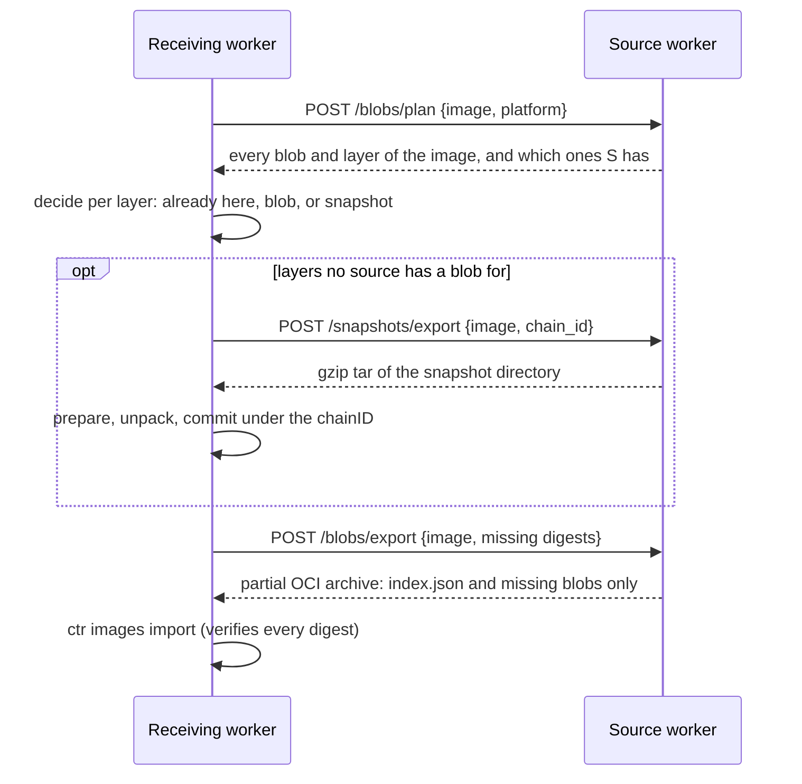

# Node-to-node transfers

[Propagation](propagation.md) and [rescue](rescue.md) move images with the
same mechanism. The controller tells the receiving worker which image to get
and from which peers. The receiver does the rest and fetches only what it
lacks.

## Per-layer decisions

The source walks the image the way containerd does on a pull: index, then the
manifest for the receiver's platform, then config and layers. Attestation
manifests and other platforms are skipped. For each layer, the receiver picks
the cheapest option:

1. **Already here.** The layer's unpacked snapshot, named by its chainID, is
   on the node. Nothing to do.
2. **Blob.** The compressed layer, from the node's own content store or from
   any source that has it. The receiver asks other sources for their plans
   before settling for a snapshot.
3. **Snapshot.** Only when no source has the blob.

## Blobs

Sources read committed blobs straight from containerd's content store
(`CONTAINERD_ROOT`), where they are immutable files named by digest, rather
than starting a `ctr` process per blob; they fall back to `ctr` when the
store isn't found. Blobs from several sources are merged into one partial
OCI archive and streamed straight into `ctr images import`, never buffered
to disk.
containerd checks every blob against its digest and size, so a broken
transfer fails the import instead of landing a corrupt image.

## Snapshots

A node can run an image without any of its layer blobs: with
`discard_unpacked_layers = true`, containerd deletes them after unpacking, and
it never downloads a layer whose snapshot already exists. A blob can't be
rebuilt from a snapshot with the same digest, so the snapshot directory itself
is shipped.

- The node's own `tar` preserves ownership, overlayfs whiteouts and
  `trusted.overlay.*` attributes. Fast gzip compresses it on the wire, and the
  receiver commits it under the layer's chainID. The import that follows finds
  those chainIDs and skips the layers.
- A snapshot needs its parent unpacked first. When layers below it do have
  blobs, the receiver first imports a small temporary **base image** of
  exactly those layers, so they arrive as verified blobs and the snapshot lands
  on top. The temporary image is removed right afterwards.

## Integrity

Snapshots can't be verified against a digest, because the tar bytes never
match the original layer. They rely on the token-authenticated peer, TCP and
gzip's CRC-32, checked before each commit.

> **Recommendation:** keep `discard_unpacked_layers = false` in containerd.
> Verified blobs, about a third of the size of snapshots, can then be used
> whenever possible. The dashboard's *Snapshot share of shipped layers* panel
> shows how often snapshots are needed.

## Interruptions

- Snapshots from a failed attempt stay pinned against containerd's garbage
  collection for `RESCUE_PIN_TTL_S`, so a retry doesn't ship them again. They
  are released right away on success.
- A restarted worker removes leftover temporary snapshots and base images, and
  releases expired pins. `angryduck_worker_rescue_cleanups_total{kind}` counts
  them.
